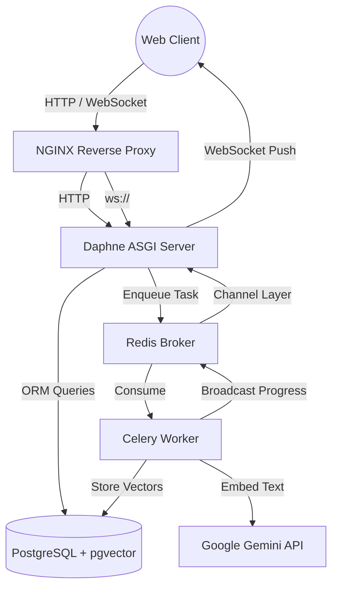
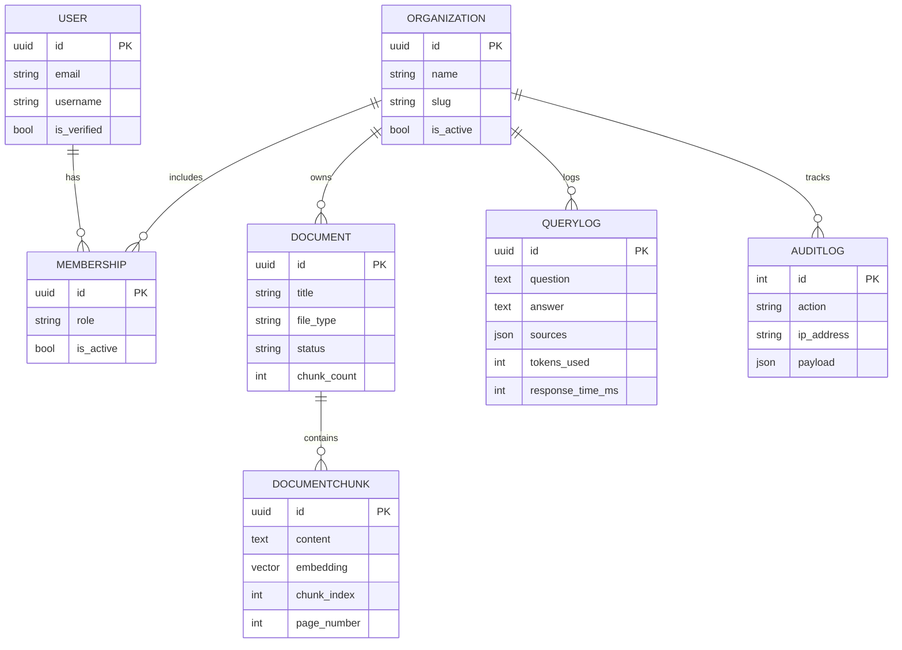
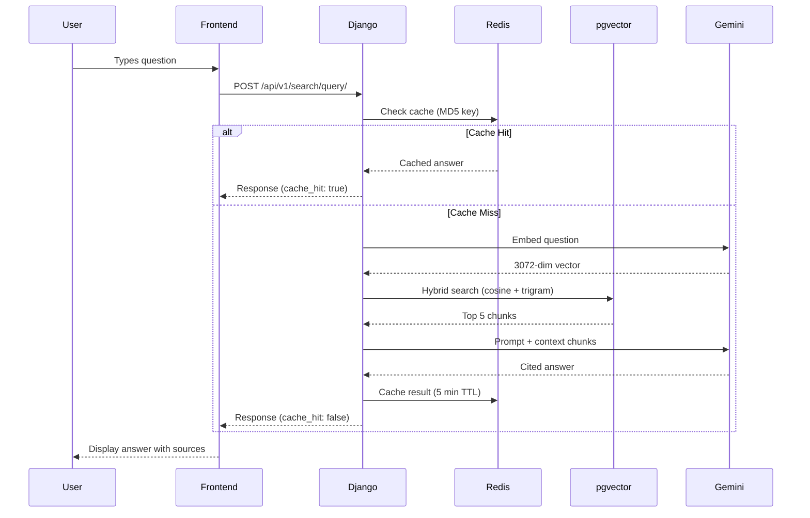

# 🧠 DocuMind — Enterprise AI Document Intelligence Platform


---

## What is DocuMind?

DocuMind is a **multi-tenant AI document intelligence platform** — think "ChatGPT for your company's private documents." Organizations upload PDFs, DOCX, and TXT files. Team members ask natural language questions in plain English. DocuMind finds the most semantically relevant passages across all uploaded documents and generates a cited, accurate answer using Google Gemini.

Built to demonstrate production-grade backend engineering: multi-tenancy, vector search, async processing pipelines, real-time WebSockets, role-based access control, audit logging, and full Docker deployment.

---

## System Architecture



---

## Technology Stack

| Layer | Technology | Why |
|---|---|---|
| Backend | Django 5.1 + DRF | Battle-tested, rich ecosystem, admin panel |
| Database | PostgreSQL 16 | ACID compliance, pgvector extension support |
| Vector Search | pgvector 0.8.2 | Semantic similarity search inside PostgreSQL — no separate vector DB |
| Embeddings | Google Gemini `gemini-embedding-001` | 3072-dimension embeddings via `google-genai` SDK |
| LLM | Google Gemini `gemini-2.0-flash-lite` | Answer generation with cited sources |
| Hybrid Search | pgvector cosine similarity + pg_trgm | 70% semantic + 30% keyword — better recall than either alone |
| Async Pipeline | Celery + Redis | Document ingestion runs in background, never blocks the request |
| Real-time | Django Channels + Daphne | WebSocket progress updates during ingestion |
| Auth | JWT (SimpleJWT) + Token Blacklisting | Stateless auth with secure logout |
| RBAC | Django Guardian + custom permissions | Object-level permissions per tenant |
| Frontend | HTMX + Vanilla CSS | SPA-like feel without React complexity |
| Security | django-ratelimit, bleach, Redis cache | Rate limiting, XSS sanitization, IP-based throttling |
| Observability | structlog + health check endpoint | Structured JSON logs, `/health/` endpoint for DB/Redis/Celery |
| Caching | Redis | Query result cache (5-min TTL), session cache, rate limit counters |
| Deployment | Docker Compose + NGINX | 6-container production stack |
| Tests | pytest + pytest-django | 28 tests covering auth, RBAC, ingestion, chunking, audit |

---

## Core Features

### 1. Multi-Tenant Architecture
Every resource — documents, queries, audit logs — is strictly isolated per organization. A user can belong to multiple organizations with different roles. The `TenantMiddleware` attaches the organization context to every request via `X-Organization-ID` header.

### 2. Role-Based Access Control
Four roles with enforced permissions at API and frontend level:

| Role | Upload Docs | Run Queries | View Audit Log | Manage Members |
|---|---|---|---|---|
| OWNER | ✅ | ✅ | ✅ | ✅ |
| ADMIN | ✅ | ✅ | ✅ | ✅ |
| MEMBER | ✅ | ✅ | ❌ | ❌ |
| VIEWER | ❌ | ❌ | ❌ | ❌ |

### 3. Document Ingestion Pipeline
```
Upload PDF/DOCX/TXT →
Celery task fires async →
Text extracted per page (PyPDF2, python-docx) →
Chunked (500 words, 50-word overlap, page-aware) →
Embedded via Gemini (3072 dims) →
Bulk saved to pgvector →
Status → READY
Real-time WebSocket progress broadcast at each stage
```

### 4. Hybrid RAG Query Engine
```
User asks question →
Question embedded via Gemini →
pgvector cosine similarity search (semantic) +
pg_trgm trigram search (keyword) →
Combined score: 70% vector + 30% text →
Top 5 chunks → Gemini generates cited answer →
Result cached in Redis for 5 minutes
```

### 5. Query Result Caching
Identical questions from the same organization return instantly from Redis cache with `cache_hit: true` in the response — no redundant API calls, no cost waste.

### 6. Audit Logging
Every significant action is permanently logged with actor, organization, IP address, timestamp, and JSON payload. Visible to OWNER only at `/audit/`. Actions logged: `USER_LOGGED_IN`, `USER_REGISTERED`, `DOCUMENT_UPLOADED`, `QUERY_EXECUTED`.

### 7. Real-Time WebSocket Progress
As documents are ingested, progress updates are broadcast via Django Channels through Redis channel layer to the browser — 10% extracting → 30% chunking → 50% embedding → 80% saving → 100% ready.

### 8. Health Check Endpoint
`GET /health/` returns the status of all three critical dependencies:
```json
{
  "status": "healthy",
  "services": {
    "database": {"status": "healthy"},
    "redis": {"status": "healthy"},
    "celery": {"status": "healthy", "workers": 1}
  }
}
```
Returns `200` if healthy, `503` if degraded.

### 9. Security Hardening
- Rate limiting: 5/min on auth, 10/min on upload, 30/min on queries
- XSS sanitization via `bleach` on all user input
- JWT token blacklisting on logout
- Security headers: `X-Frame-Options`, `Content-Type-Nosniff`, `XSS-Filter`
- IP-based rate limiting backed by Redis cache

---

## Data Model



---

## RAG Query Flow



---

## Test Coverage

28 tests across 5 apps using `pytest` + `pytest-django`:

| App | Tests | Coverage |
|---|---|---|
| accounts | 7 | Registration, login, duplicate email, redirect |
| tenants | 6 | RBAC enforcement, audit access, role verification |
| documents | 7 | Upload auth, VIEWER block, file validation, chunking, extraction |
| audit | 3 | Log creation, failure safety, admin immutability |
| search | 2 | Empty retrieval, top-k configuration |

```bash
pytest --cov=. --cov-report=term-missing
# 28 passed, 1 warning
```

---

## Local Development

### Prerequisites
- Python 3.12+
- Docker Desktop
- Git

### Setup

```bash
git clone https://github.com/Jishan198/DocuMind.git
cd DocuMind
python -m venv venv
venv\Scripts\activate        # Windows
pip install -r requirements.txt
cp .env.example .env
```

Edit `.env`:
```env
SECRET_KEY=your-secret-key
DEBUG=True
DJANGO_SETTINGS_MODULE=config.settings.development
DB_NAME=documind_db
DB_USER=postgres
DB_PASSWORD=your-password
DB_HOST=localhost
DB_PORT=5432
REDIS_URL=redis://localhost:6379/0
CELERY_BROKER_URL=redis://localhost:6379/1
GOOGLE_API_KEY=your-gemini-api-key
```

### Start Services

```bash
# Start PostgreSQL + Redis
docker compose up -d postgres redis

# Apply migrations
python manage.py migrate

# Terminal 1 — Django
python manage.py runserver

# Terminal 2 — Celery
celery -A config worker --loglevel=info --pool=solo
```

Open `http://127.0.0.1:8000/auth/register/`

### Run Tests

```bash
pytest --cov=. --cov-report=term-missing
```

---

## Docker Deployment (Full Stack)

```bash
docker compose up -d --build
docker compose ps
```

Six containers start in dependency order:
1. `documind-postgres` — pgvector-enabled PostgreSQL 16
2. `documind-redis` — Redis 7 (broker + cache + channel layer)
3. `documind-web` — Django/Daphne ASGI server
4. `documind-celery` — Celery worker
5. `documind-nginx` — Reverse proxy + static files
6. `documind-pgadmin` — Database GUI at `:5050`

Health checks ensure postgres and redis are ready before web/celery start.

Verify: `http://localhost/health/`

---

## AWS EC2 Deployment

### 1. Provision Instance
- **OS:** Ubuntu Server 24.04 LTS
- **Instance Type:** `t3.small`
- **Security Groups:** Open ports `80` (HTTP), `22` (SSH), `5050` (pgAdmin)

### 2. Install Docker
```bash
ssh -i "your-key.pem" ubuntu@<YOUR_EC2_IP>
sudo apt-get update -y
sudo apt-get install -y docker.io docker-compose-v2 git
sudo systemctl enable --now docker
sudo usermod -aG docker ubuntu
```
Log out and back in.

### 3. Deploy
```bash
git clone https://github.com/Jishan198/DocuMind.git
cd DocuMind
cp .env.example .env
nano .env
```

Production `.env` settings:
```env
DJANGO_SETTINGS_MODULE=config.settings.production
DEBUG=False
ALLOWED_HOSTS=<YOUR_EC2_IP>
CSRF_TRUSTED_ORIGINS=http://<YOUR_EC2_IP>
DB_HOST=postgres
REDIS_URL=redis://redis:6379/0
CELERY_BROKER_URL=redis://redis:6379/1
GOOGLE_API_KEY=your-key
SECRET_KEY=your-long-random-key
DB_PASSWORD=your-strong-password
```

```bash
docker compose up -d --build
docker compose exec web python manage.py createsuperuser
```

### 4. Access
- **Application:** `http://<YOUR_EC2_IP>`
- **Admin:** `http://<YOUR_EC2_IP>/admin/`
- **pgAdmin:** `http://<YOUR_EC2_IP>:5050`
- **Health:** `http://<YOUR_EC2_IP>/health/`

---

## API Reference

All endpoints require `Authorization: Bearer <access_token>` header.
Tenant-scoped endpoints also require `X-Organization-ID: <org_uuid>`.

| Method | Endpoint | Description | Auth |
|---|---|---|---|
| POST | `/api/v1/auth/register/` | Register + get JWT | Public |
| POST | `/api/v1/auth/login/` | Login + get JWT | Public |
| POST | `/api/v1/auth/logout/` | Blacklist refresh token | JWT |
| GET | `/api/v1/auth/me/` | Current user profile | JWT |
| POST | `/api/v1/organizations/` | Create organization | JWT |
| GET | `/api/v1/documents/` | List org documents | JWT + Org |
| POST | `/api/v1/documents/upload/` | Upload document | JWT + Org |
| GET | `/api/v1/documents/<id>/` | Document detail | JWT + Org |
| POST | `/api/v1/search/query/` | RAG query | JWT + Org |
| GET | `/api/v1/search/history/` | Query history | JWT + Org |
| GET | `/api/v1/audit/` | Audit log (admin only) | JWT + Org |
| GET | `/health/` | System health check | Public |

---

## Project Structure

```
DocuMind/
├── accounts/          # Custom User model, JWT auth endpoints
├── tenants/           # Organization, Membership, RBAC permissions, middleware
├── documents/         # Document model, ingestion pipeline, Celery tasks
│   └── services/      # TextExtractor, DocumentChunker, EmbeddingService
├── search/            # RAG engine, HybridRetriever, AnswerGenerator, QueryLog
│   └── services/
├── audit/             # AuditLog model, log_action service, API endpoint
├── dashboard/         # HTMX views, rate limiting, session auth
├── templates/         # Base + auth + dashboard HTML templates
├── config/            # Django settings (base/dev/prod), Celery, ASGI, health
├── nginx/             # nginx.conf with WebSocket support
├── Dockerfile         # Python 3.12-slim, system deps, pip install
├── docker-compose.yml # 6-service production stack with health checks
├── entrypoint.sh      # migrate + collectstatic + daphne on container start
├── conftest.py        # pytest fixtures
└── pytest.ini         # pytest configuration
```

---

*Built with precision. Designed to impress.*
