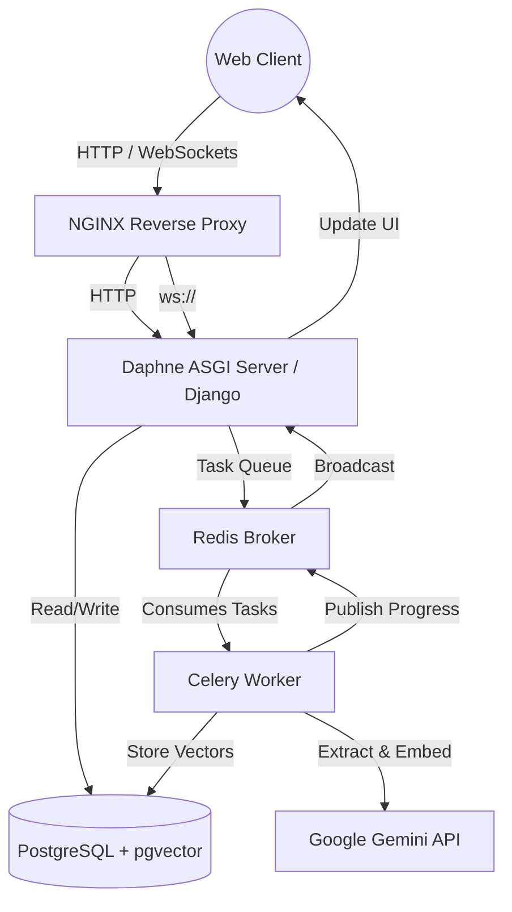
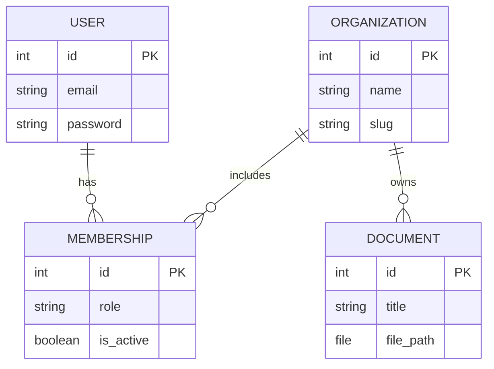
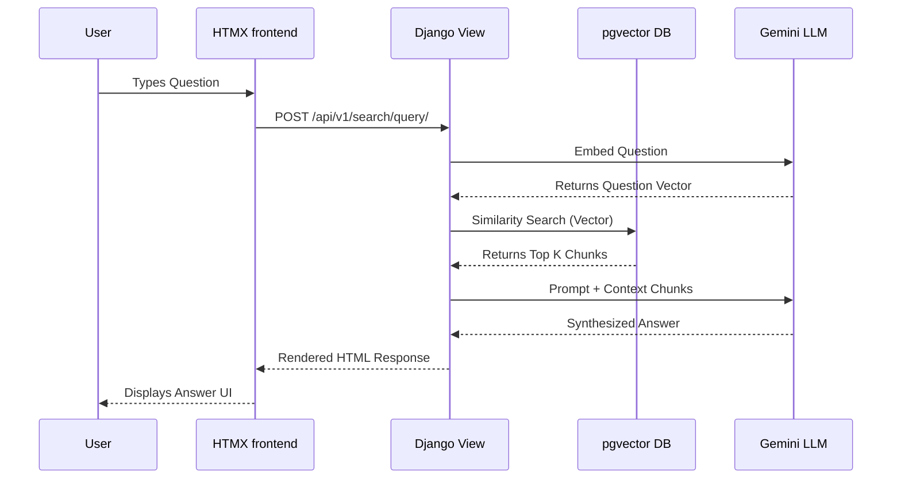

# 🧠 DocuMind: Enterprise-Grade AI Document Intelligence Platform

     

## 📖 Welcome to DocuMind

**DocuMind** is a state-of-the-art, multi-tenant Software-as-a-Service (SaaS) application designed to revolutionize how organizations interact with their internal knowledge bases. Built from the ground up to solve complex data retrieval problems, DocuMind allows businesses to upload vast amounts of unstructured data (PDFs, DOCX, TXT) and instantly query that data using advanced **Retrieval-Augmented Generation (RAG)**. 

By leveraging the power of **Google's Gemini Large Language Model**, orchestrated through **LangChain**, and grounded by a highly performant **PostgreSQL + pgvector** database, DocuMind provides accurate, context-aware answers to user queries in real-time.

This repository serves as a masterclass in modern web architecture, demonstrating a rigorous 7-phase development lifecycle that spans from foundational environment configuration to enterprise-grade security hardening and cloud deployment.

---

## 🏗️ High-Level System Architecture

DocuMind is built on a distributed, asynchronous architecture ensuring high availability, performance under load, and strict data isolation between tenants.



---

## 🛠️ Comprehensive Technology Stack

| Category | Technology | Purpose & Implementation |
| :--- | :--- | :--- |
| **Backend Framework** | Django 5.1 & DRF | Core business logic, ORM, API routing, and robust MVC architecture. |
| **Database** | PostgreSQL 16 | Primary relational data store. |
| **Vector Engine** | pgvector | High-performance similarity search and embeddings storage. |
| **Asynchronous Queue** | Celery | Offloading heavy document parsing and LLM API calls from the request cycle. |
| **Message Broker** | Redis | Message brokering for Celery and Channel Layer for WebSockets. |
| **Real-Time Comm.** | Django Channels & Daphne | Handling WebSocket connections for live UI updates. |
| **AI & LLM** | LangChain & Google Gemini Pro | Orchestrating RAG workflows, generating embeddings, and synthesizing answers. |
| **Frontend Dynamics** | HTMX & Vanilla CSS | Building Reactive SPA-like interfaces without heavy JavaScript payloads. |
| **Security** | django-ratelimit, bleach | Endpoint protection, DDOS mitigation, and XSS sanitization. |
| **Containerization** | Docker & Docker Compose | Ensuring reproducible, isolated environments for production deployment. |

---

## 🚀 The Development Journey: A Phase-by-Phase Breakdown

The development of DocuMind was strategically broken down into 7 distinct phases, each building a critical layer of the application's infrastructure.

### 🛡️ Phase 1: Foundation & Core Architecture
The initial phase focused on laying an unshakeable foundation for the application.

*   **Environment Initialization:** Established a strictly controlled Python virtual environment.
*   **Dependency Management:** Curated a `requirements.txt` isolating exact versions for Django, DRF, Celery, Redis, and LangChain.
*   **Project Scaffolding:** Initialized the Django project and modularized it into distinct apps: `accounts`, `tenants`, `documents`, `search`, and `dashboard`.
*   **Infrastructure Configuration:** Drafted the initial `docker-compose.yml` to spin up PostgreSQL and Redis, ensuring the application had its necessary backing services from day one.

---

### 🏢 Phase 2: Multi-Tenancy & Access Control
SaaS applications require absolute data isolation. Phase 2 implemented the core B2B data model.

*   **Custom User Model:** Replaced Django's default User model with a custom `EmailUser` model, enforcing email-based authentication over legacy usernames.
*   **Organization & Membership:** Designed the `Organization` and `Membership` models. A User can belong to multiple Organizations, but data is strictly partitioned.
*   **Role-Based Access Control (RBAC):** Integrated `django-guardian` to provide granular, object-level permissions.
*   **Authentication Flows:** Developed secure registration and login views, managing session state while seamlessly redirecting users to their organization's isolated dashboard.



---

### 🧠 Phase 3: AI Vector Database & Document Ingestion
This phase transformed the application from a standard web app into an AI powerhouse.

*   **pgvector Integration:** Configured PostgreSQL to store high-dimensional floating-point arrays representing semantic meaning.
*   **Document Parsing:** Implemented native Python libraries (`PyPDF2`, `python-docx`) to crack open user-uploaded files and extract raw text reliably.
*   **Chunking & Embeddings:** Developed the logic pipeline that takes raw text, splits it into semantic chunks using LangChain's `RecursiveCharacterTextSplitter`, and sends those chunks to the **Google Gemini Embedding Model**.
*   **Celery Workers:** Because generating embeddings takes time, this entire pipeline was moved into a background `Celery` task, ensuring the user's browser never hangs while waiting for a document to process.

---

### 💬 Phase 4: Retrieval-Augmented Generation (RAG) Engine
With documents ingested and vectorized, Phase 4 focused on querying the data.

*   **Vector Similarity Search:** Implemented the cosine similarity search against the database. When a user asks a question, the system converts the question to an embedding and finds the closest matching document chunks.
*   **Context Injection:** The retrieved chunks are dynamically injected into a strictly engineered prompt template, which is securely passed to **Gemini Pro**.
*   **HTMX Chat Interface:** Built a sleek, responsive chat interface. When a user submits a question, HTMX fires a POST request, and the server responds with pure HTML containing the AI's synthesized answer, updating the DOM seamlessly.
*   **Prompt Engineering:** The LLM is explicitly instructed to act as a supportive assistant. Crucially, it is bounded by the context—if the answer is not in the uploaded documents, it gracefully declines to hallucinate an answer.



---

### ⚡ Phase 5: Real-Time WebSockets & Task Monitoring
To provide a premium user experience, Phase 5 introduced real-time bidirectional communication.

*   **ASGI Migration:** Transitioned the application from standard synchronous WSGI to asynchronous ASGI using **Daphne**.
*   **Django Channels:** Implemented native WebSocket support. Configured routing and building a custom consumer (`DocumentConsumer`) to handle socket connections securely.
*   **Cross-Process Communication:** Modified the Celery background worker to broadcast messages to Redis. Redis then pushes those messages through the Channel Layer to Daphne, which pushes them to the client's browser.
*   **Dynamic UI:** As a document moves from `PENDING` -> `EXTRACTING` -> `CHUNKING` -> `EMBEDDING` -> `READY`, the user's dashboard updates instantly with animated progress bars, without requiring a page refresh.

---

### 🛡️ Phase 6: Production Hardening & Security
Prior to deployment, the application underwent a rigorous security pass to ensure it was enterprise-ready.

*   **System Audit Logging:** Built a centralized `AuditLog` system. Every critical action (login attempts, document uploads, query executions) is permanently recorded with the User ID, Tenant ID, IP Address, and custom JSON payload. This provides a clear, undeniable paper trail for compliance.
*   **Rate Limiting:** Implemented `django-ratelimit` to thwart abuse and control API costs.
    *   Authentication endpoints: `5 req / min`
    *   Upload endpoints: `10 req / min`
    *   Query endpoints: `30 req / min`
*   **Input Sanitization:** Integrated Mozilla's `bleach` library. Every piece of user input (from document titles to chat questions) is aggressively scrubbed of HTML and script tags to prevent Stored and Reflected XSS attacks.
*   **Security Headers:** Enforced `X-Frame-Options`, `Content-Type-Nosniff`, and `Cross-Site-Scripting-Filters` at the Django middleware level.

---

### 🐳 Phase 7: Containerization & Cloud Deployment
The final phase packaged the complex application into a highly portable, scalable Docker stack, ready for deployment to AWS.

*   **Dockerization:** Created a lean, multi-stage `Dockerfile` based on `python:3.12-slim`.
*   **NGINX Reverse Proxy:** Engineered an `nginx.conf` that securely routes external port 80 traffic to the internal Daphne server, specifically handling the tedious WebSocket `Upgrade` headers and serving static/media files efficiently.
*   **Docker Compose:** Wrote a unified orchestration file that spins up 6 interconnected containers:
    1.  `web` (Django/Daphne)
    2.  `celery` (Background Worker)
    3.  `nginx` (Web Server)
    4.  `postgres` (Database)
    5.  `redis` (Broker)
    6.  `pgadmin` (Database GUI for administration)
*   **Automation:** Developed an `entrypoint.sh` script to automatically apply database migrations and collect static files upon container boot.

---

## 💻 Local Development Guide

If you wish to run the source code on your local development machine:

1. **Clone the Repository**
   ```bash
   git clone https://github.com/YourUsername/DocuMind.git
   cd DocuMind
   ```

2. **Virtual Environment Setup**
   ```bash
   python -m venv venv
   source venv/bin/activate  # Or venv\Scripts\activate on Windows
   pip install -r requirements.txt
   ```

3. **Environment Secrets**
   ```bash
   cp .env.example .env
   ```
   *Fill in your database credentials and Gemini API Key.*

4. **Initialize Database**
   ```bash
   python manage.py migrate
   ```

5. **Start the Development Servers**
   You will need to run the web server and the background worker simultaneously in separate terminal windows.
   
   *Terminal 1:*
   ```bash
   python manage.py runserver
   ```
   *Terminal 2:*
   ```bash
   celery -A config worker --loglevel=info --pool=solo
   ```

---

## ☁️ AWS Cloud Deployment Guide

DocuMind is structurally ready to be deployed to an AWS EC2 instance. Follow these exact steps for deployment.

### 1. Provision AWS Infrastructure
Launch a new EC2 instance from your AWS console.
*   **OS:** Ubuntu Server 24.04 LTS
*   **Instance Type:** `t3.small` (Required to handle vector operations and in-memory compilation).
*   **Security Groups:** Open Port `80` (HTTP), Port `22` (SSH), and Port `5050` (pgAdmin).

### 2. Server Configuration
SSH into your newly provisioned instance:
```bash
ssh -i "your-key.pem" ubuntu@<YOUR_EC2_IP>
```

Install Docker and Git:
```bash
sudo apt-get update -y
sudo apt-get install -y docker.io docker-compose-v2 git
sudo systemctl enable --now docker
sudo usermod -aG docker ubuntu
```
*(Log out and back in to apply group changes).*

### 3. Deploy the Application
Clone the repository to your server and configure your secrets.
```bash
git clone https://github.com/YourUsername/DocuMind.git
cd DocuMind

# Setup Environment
cp .env.example .env
nano .env 
```

**Crucial `.env` Settings for Production:**
*   `DJANGO_SETTINGS_MODULE=config.settings.production`
*   `ALLOWED_HOSTS=*` (Or limit to your specific IP/Domain)
*   `CSRF_TRUSTED_ORIGINS=http://<YOUR_EC2_IP>`
*   `GEMINI_API_KEY=<your_key>`

### 4. Launch Stack
Start the entire infrastructure using Docker Compose:
```bash
sudo docker compose up -d --build
```

### 5. Access Platforms
*   **Main Application:** `http://<YOUR_EC2_IP>`
*   **Database Management (pgAdmin):** `http://<YOUR_EC2_IP>:5050`
    *   *Login with the credentials you provided in your `.env` file.*

---
*Developed with focus, precision, and an emphasis on clean architecture.*
